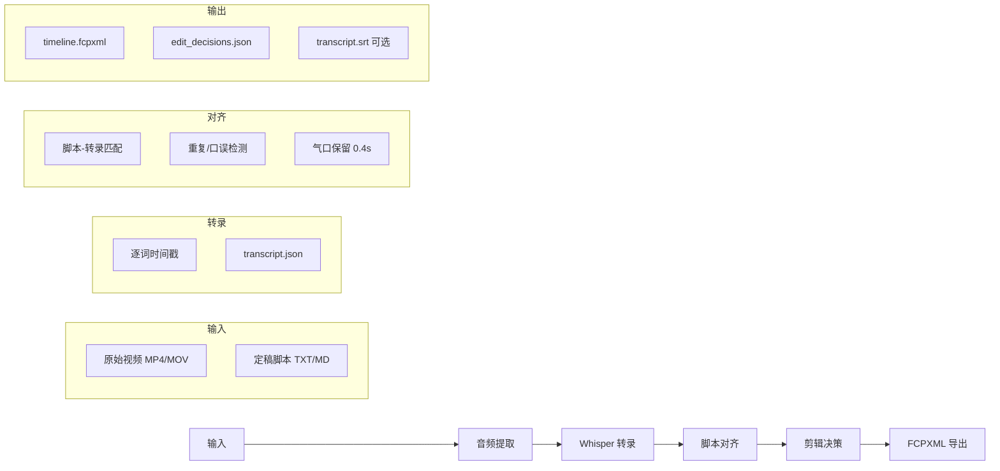

# AI 辅助 A-Roll 初剪 — 技术方案

> 基于 **Video-editing-CLI**，实现「原始口播视频 + 脚本 → FCPXML 时间轴」的 A-Roll 粗剪自动化。  
> 与 [Vplatform-CLI](../../Vplatform-CLI/docs/功能说明.md)（AI 生成短视频）互补，覆盖**真实素材后期**链路。  
> 相关文档：[DSC3 融合方案](../../../02%20POC/DSC3/guide/融合方案.md) · [短视频方案](../../../02%20POC/DSC3/guide/短视频方案.md)

---

## 一、方案总览

### 1.1 定位

| 维度 | Vplatform-CLI | Video-editing-CLI |
|------|---------------|-------------------|
| 输入 | 主题 / 分镜 JSON | 原始口播视频 + 定稿脚本 |
| 输出 | `final.mp4`（AI 生成成片） | `timeline.fcpxml` + 剪辑决策 JSON |
| 核心场景 | 3–8 镜 AI 短视频量产 | 口播类长素材 A-Roll 初剪 |
| 人工后续 | 可选微调 | **必须**：B-Roll / 调色 / 音效 |

Video-editing-CLI 在 15CLI 生态中定位为 **Layer 4 — 真实素材后期编排**：

```
┌─────────────────────────────────────────────────────────────┐
│  Layer 1: 直接三方 API     → LLM 脚本匹配 / 云端 ASR 回退    │
├─────────────────────────────────────────────────────────────┤
│  Layer 2: Comfyui-CLI      → B-Roll 素材生成（可选）         │
├─────────────────────────────────────────────────────────────┤
│  Layer 3: Vplatform-CLI    → AI 生成短视频一键成片           │
├─────────────────────────────────────────────────────────────┤
│  Layer 4: Video-editing-CLI → 真实素材 A-Roll 初剪 → FCPXML  │
└─────────────────────────────────────────────────────────────┘
```

### 1.2 核心价值

- **输入极简**：创作者只需提供原始视频 + 脚本，无需手动标记切点
- **时间轴可编辑**：输出 FCPXML，导入达芬奇 / Final Cut Pro / 剪映专业版继续精修
- **效率量化**：50 分钟口播素材，传统人工 A-Roll 约 **2 小时** → AI 粗剪 **数分钟**，成片保留约 **40%**（19 分钟）

### 1.3 端到端数据流



---

## 二、AI 辅助剪辑流程

### 2.1 创作者工作流

```
1. 拍摄口播（A-Roll）→ 导出原始视频
2. 准备定稿脚本（与口播内容一致或为目标成稿）
3. 运行 Video-editing-CLI
4. 导入 FCPXML 到达芬奇 / FCP
5. 人工：删改 AI 标记、补 B-Roll、调色、音效
6. 导出成片
```

### 2.2 CLI 主命令（规划）

```bash
# 完整 A-Roll 初剪流水线
video-edit aroll run \
  --video raw_talk.mp4 \
  --script script.txt \
  --output ./outputs/job_001

# 分阶段执行（断点续跑）
video-edit aroll transcribe --video raw_talk.mp4
video-edit aroll align --transcript transcript.json --script script.txt
video-edit aroll export --decisions edit_decisions.json --video raw_talk.mp4

# Mock 验收（无 GPU / 无 Whisper）
video-edit aroll run --demo
```

### 2.3 流水线阶段

| 阶段 | 进度 | 依赖 | 产出 |
|------|------|------|------|
| **extract** | 10% | ffmpeg | `audio.wav` |
| **transcribe** | 30% | Whisper / WhisperX | `transcript.json`（逐词时间戳） |
| **align** | 55% | 脚本匹配引擎 | `edit_decisions.json` |
| **refine** | 75% | 静音检测 + 气口规则 | 更新 decisions（保留 0.4s 换气间隙） |
| **export** | 95% | FCPXML / EDL / SRT 生成器 | 多格式时间轴 |

---

## 三、A-Roll 剪辑挑战与 AI 方案

### 3.1 问题定义

口播素材常见问题：

| 问题类型 | 表现 | 处理策略 |
|----------|------|----------|
| 重复拍摄 | 同一句多次尝试 | 保留脚本匹配的「最终 take」 |
| 口误重录 | 说错后立刻重说 | 标记前段为删除，保留后段 |
| 长停顿 | >1.5s 无语音 | 整段删除 |
| 冗余填充 | 「嗯」「那个」过多 | 可选过滤（默认保留自然语气） |
| 气口断裂 | 切太紧听感不连贯 | **保留 0.4s 换气间隙** |

传统人工：逐句听辨 + 手打标记，50 分钟素材 ≈ **2 小时**。

### 3.2 技术实现

#### Step 1 — 音频提取与转录

```
video → ffmpeg 提取 mono 16kHz WAV
     → Whisper（word_timestamps=True）
     → transcript.json
```

**transcript.json 结构（规划）：**

```json
{
  "language": "zh",
  "duration_sec": 3120.5,
  "words": [
    {"text": "今天", "start": 1.24, "end": 1.58, "confidence": 0.98},
    {"text": "我们", "start": 1.60, "end": 1.82, "confidence": 0.97}
  ],
  "segments": [
    {"id": 0, "start": 1.24, "end": 15.3, "text": "今天我们来聊..."}
  ]
}
```

**模型选型：**

| 场景 | 主选 | Fallback |
|------|------|----------|
| 本地 GPU | Whisper large-v3 + WhisperX 强制对齐 | faster-whisper |
| 云端 | OpenAI `whisper-1` / `gpt-4o-transcribe` | — |
| 中文优化 | Qwen3-ASR + ForcedAligner（参考 pycut） | Whisper |

#### Step 2 — 脚本-转录对齐（WISP-COPY 语义）

用户描述的 **WISP-COPY** 指「脚本 ↔ 口播转录」的片段对齐与拷贝决策引擎，实现上采用 **多级匹配**：

```
定稿脚本（段落/句子）
  ↓ 分句 + 归一化（去标点、繁简、同音容错）
转录 words[] 滑动窗口匹配
  ↓ 相似度评分（编辑距离 + embedding 可选）
识别：重复 take / 口误 / 未说段落
  ↓ LLM 辅助（长段落歧义时）
输出 edit_decisions.json
```

**对齐策略：**

1. **句子级锚定**：脚本每句在转录中找最佳匹配区间（动态规划 / Smith-Waterman）
2. **重复检测**：同一脚本句出现多次 → 保留置信度最高且位置最后的 take
3. **删除标记**：未匹配到脚本的转录区间 → `action: "cut"`
4. **LLM 复核**（可选）：OpenAI 对 ambiguous 区间做「保留/删除」二分类

#### Step 3 — 气口与切点精修

```
对每个保留区间 [start, end]:
  pre_buffer  = 0.1s   # 切点前缓冲
  post_buffer = 0.4s   # 气口保留（用户指定）
  silence_threshold = -40 dBFS  # 静音检测

切点 = max(word.start - pre_buffer, prev.end + breath_gap)
```

**关键参数（可配置）：**

| 参数 | 默认 | 说明 |
|------|------|------|
| `breath_gap_sec` | `0.4` | 换气间隙保留秒数 |
| `pre_cut_buffer` | `0.1` | 切点前缓冲 |
| `post_cut_buffer` | `0.1` | 切点后缓冲 |
| `silence_threshold_db` | `-40` | 静音判定阈值 |
| `min_keep_sec` | `0.3` | 最短保留片段 |

#### Step 4 — FCPXML 导出

```
edit_decisions.json + 源视频 metadata
  → 构建 FCPXML 1.11 spine
  → 每段保留区间 = 一个 clip 引用源 media
  → timeline.fcpxml
```

**edit_decisions.json 结构（规划）：**

```json
{
  "source_video": "raw_talk.mp4",
  "frame_rate": 30,
  "total_source_sec": 3120,
  "total_output_sec": 1140,
  "retain_ratio": 0.37,
  "clips": [
    {
      "id": "clip_001",
      "action": "keep",
      "source_in": 12.4,
      "source_out": 28.7,
      "script_ref": "段落1-句1",
      "reason": "matched_script"
    },
    {
      "id": "gap_001",
      "action": "cut",
      "source_in": 28.7,
      "source_out": 45.2,
      "reason": "duplicate_take"
    }
  ],
  "stats": {
    "cuts": 87,
    "kept_clips": 42,
    "breath_gaps_applied": 41
  }
}
```

---

## 四、工作流优化与工具整合

### 4.1 自动化 vs 人工分工

| 环节 | 负责方 | 说明 |
|------|--------|------|
| A-Roll 粗剪 | **Video-editing-CLI** | 删重复、留气口、对齐脚本 |
| B-Roll 插入 | 人工 + 可选 AI | 可用 Comfyui-CLI 生成素材 |
| 调色 | 人工 | 达芬奇 / FCP |
| 音效 / BGM | 人工 或 Vplatform FFmpeg 链路 | 精修阶段 |
| 字幕 | 可选自动 | 转录稿 → SRT，与 FCPXML 同步 |

### 4.2 NLE 兼容性

| 软件 | FCPXML 支持 | 注意事项 |
|------|-------------|----------|
| **DaVinci Resolve** | ✅ 完整 | 推荐，免费且 XML 导入稳定 |
| **Final Cut Pro** | ✅ 原生 | FCPXML 1.11 标准 |
| **剪映专业版** | ⚠️ 部分 | 可导入，复杂特效/标记可能丢失 |
| **Premiere Pro** | ❌ 需转换 | 可额外导出 EDL / SRT |

**导出前检查：**

- 项目帧率与 `--frame-rate` 一致（默认 30fps）
- 源媒体路径使用绝对路径或 NLE 可解析的 `file://` URI
- 首帧对齐到帧边界（避免 1 帧漂移）

### 4.3 与 DSC3 整合（规划）

```
DSC3 创作页
  ├─ 剧本管理（已有 script_analyzer）
  ├─ 「A-Roll 初剪」入口
  │     → 上传口播视频 + 选用已定稿脚本
  │     → video_edit_client.py 调 Video-editing-CLI
  │     → 返回 FCPXML 下载 + 决策 JSON 预览
  └─ 与 Vplatform 一键成片并列，场景互斥：
        真实口播素材 → Video-editing-CLI
        AI 生成分镜   → Vplatform-CLI
```

**DSC3 新增能力矩阵（规划）：**

| 能力 | 节点 | Video-editing-CLI | 直接 API | 主选 |
|------|------|:-----------------:|:--------:|------|
| A-Roll 初剪 | `aroll-rough-cut` | ✅ | ❌ | **Video-editing-CLI** |
| 口播转录 | `aroll-transcribe` | ✅ | ⚠️ OpenAI ASR | **本地 Whisper** |
| 脚本对齐 | `aroll-align` | ✅ | ⚠️ OpenAI LLM | **CLI 内置 + LLM 复核** |
| FCPXML 导出 | `aroll-export` | ✅ | ❌ | **Video-editing-CLI** |
| B-Roll 生成 | `storyboard-image` | — | — | Comfyui-CLI（已有） |

---

## 五、CLI 工程规划

### 5.1 目录结构（15CLI 标准）

```
Video-editing-CLI/
├── pyproject.toml              # entry_points: video-edit
├── README.md
├── verify.sh                   # --demo 验收
├── .env.example
├── config.yaml.example
├── guide/
│   └── A-Roll剪辑方案.md       # 本文档
├── scripts/
│   ├── start.sh                # 可选 Web API
│   └── stop.sh
├── tests/
│   ├── test_transcribe.py
│   ├── test_align.py
│   └── test_fcpxml.py
├── video_edit/
│   ├── __init__.py
│   ├── cli.py                  # Click 入口
│   ├── config.py
│   ├── pipelines/
│   │   └── aroll.py            # 主流水线
│   ├── services/
│   │   ├── audio.py            # ffmpeg 提取
│   │   ├── transcribe.py       # Whisper / WhisperX
│   │   ├── align.py            # 脚本对齐（WISP-COPY 逻辑）
│   │   ├── silence.py          # 静音 / 气口检测
│   │   └── fcpxml.py           # FCPXML 1.11 生成
│   ├── models/
│   │   ├── transcript.py
│   │   └── edit_decision.py
│   └── utils/
│       ├── logger.py
│       └── errors.py
└── agent/
    └── manifest.json
```

### 5.2 命令设计

```bash
video-edit --version
video-edit --help

video-edit aroll run       # 完整流水线
video-edit aroll transcribe
video-edit aroll align
video-edit aroll export

video-edit config init     # 生成本地 config.yaml
video-edit health          # ffmpeg / whisper 依赖检测
```

**全局选项：** `--format json` · `--verbose` · `--demo` · `--output DIR`

### 5.3 配置项

```yaml
# config.yaml.example
pipeline:
  frame_rate: 30
  breath_gap_sec: 0.4
  pre_cut_buffer: 0.1
  post_cut_buffer: 0.1
  silence_threshold_db: -40

transcribe:
  model: large-v3          # tiny | base | small | medium | large-v3
  language: zh
  word_timestamps: true
  device: auto             # cuda | cpu | mps

align:
  match_threshold: 0.75    # 脚本-转录相似度阈值
  use_llm_review: false    # 歧义区间 LLM 复核
  llm_model: gpt-4o-mini

export:
  fcpxml_version: "1.11"
  include_srt: true
  media_path_style: absolute  # absolute | relative
```

### 5.4 日志与可观测

```
logs/tasks/{job_id}/
├── extract.log
├── transcribe.log
├── align.log
├── export.log
└── summary.json          # 耗时、保留率、切点数
```

---

## 六、案例基准

### 6.1 参考案例：50 分钟口播

| 指标 | 传统人工 | AI 粗剪 + 人工精修 |
|------|----------|-------------------|
| A-Roll 初剪耗时 | ~2 小时 | ~3–5 分钟（CLI） |
| 源素材时长 | 50 分钟 | 50 分钟 |
| 初剪保留 | — | ~40%（19 分钟） |
| 最终成片 | 人工定稿 | AI 粗剪 + B-Roll/调色/音效 |
| 可编辑性 | 手搓时间轴 | FCPXML 导入 NLE 微调 |

### 6.2 验收标准（DoD）

- [ ] `video-edit aroll run --demo` 在无 GPU 环境通过 verify.sh
- [ ] 真实 10 分钟口播 + 脚本 → 生成可导入达芬奇的 FCPXML
- [ ] `edit_decisions.json` 含完整切点理由，支持人工 override 后重新 export
- [ ] 气口参数 `breath_gap_sec=0.4` 切点听感连贯（主观评测）
- [ ] 50 分钟素材端到端 < 15 分钟（本地 GPU + large-v3）

---

## 七、落地路线

### Phase 1 — MVP（A-Roll 粗剪闭环）

- [x] 项目脚手架（pyproject + Click + verify.sh）
- [x] ffmpeg 音频提取
- [x] Whisper 转录（word timestamps，faster-whisper 可选）
- [x] 脚本-转录句子级对齐（规则引擎，无 LLM）
- [x] FCPXML 1.11 导出
- [x] `--demo` Mock 数据验收

### Phase 2 — 质量提升

- [x] WhisperX 强制对齐（`transcribe.use_whisperx_align`，可选依赖）
- [x] 重复 take / 口误检测（WISP-COPY 完整逻辑）
- [x] 气口 0.4s + 静音阈值精修（`refine` 阶段）
- [x] LLM 歧义复核（OpenAI 可选）
- [x] SRT 字幕同步导出

### Phase 3 — 生态整合

- [x] DSC3 `video_edit_client.py` + API 路由 `/api/aroll`
- [x] 创作页「A-Roll 初剪」UI（`aroll-cut-panel.tsx`）
- [x] B-Roll 提示链路（`broll_suggestions` → Comfyui storyboard-image）
- [x] Web API（FastAPI `:8766`，对齐 Comfyui-CLI 模式）

### Phase 4 — 进阶能力

- [x] Multicam 多机位音频同步（波形互相关 → `sync_map.json`）
- [x] EDL / SRT 多格式导出（`export.formats: [fcpxml, edl, srt, jianying]`）
- [x] 剪映工程格式调研（见 `guide/剪映工程格式调研.md`，元数据 JSON 过渡）
- [x] 批量任务队列 + 断点续跑（`checkpoint.json` + `batch run --resume`）

---

## 八、技术栈

| 类别 | 技术 | 用途 |
|------|------|------|
| CLI 框架 | Click + pyproject | 命令入口 |
| 音频处理 | ffmpeg | 提取 / 静音检测 |
| ASR | Whisper / WhisperX / faster-whisper | 逐词转录 |
| 对齐 | 编辑距离 + 可选 LLM | 脚本匹配 |
| 导出 | 自研 fcpxml.py（FCPXML 1.11） | 时间轴 |
| 配置 | YAML + pydantic-settings | 参数外置 |
| 日志 | 分阶段文件日志 | 问题排查 |
| 测试 | pytest + `--demo` | 离线验收 |

---

## 九、结论

**Video-editing-CLI** 补齐 15CLI 生态中「真实口播素材后期」的空白：

> **原始视频 + 脚本 → Whisper 转录 → 脚本对齐 → FCPXML 初剪时间轴**

- 与 **Vplatform-CLI**（AI 从零生成短视频）形成 **生成 vs 剪辑** 双路径
- 与 **DSC3** 剧本管理天然衔接（脚本即对齐锚点）
- 人工仍负责 B-Roll、调色、音效——AI 只解决最耗时的 A-Roll 粗剪

当前仓库 **Phase 1 MVP 已实现**，可通过 `./verify.sh` 或 `video-edit aroll run --demo` 验收。

---

*Last Updated: 2026-07-09*
