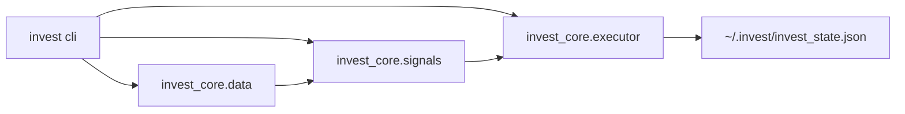

# invest CLI 架构说明

## 模块划分

```
invest/          CLI 层（Click、配置、demo、日志）
invest_core/     核心业务（数据、信号、执行、规则）
```

## 数据流



## 三维共振评分

- 宏观层 ±30：北向、汇率、ERP、美债
- 结构层 ±20：行业涨跌比、换手率
- 技术层 ±30：RSI、均线、上证涨跌幅

## 配置优先级

CLI 参数 > 环境变量 > `~/.invest/config.yaml` > 默认值

状态文件：优先 `~/.invest/`，若仅存在 `~/.hermes/invest/` 则自动回退。
