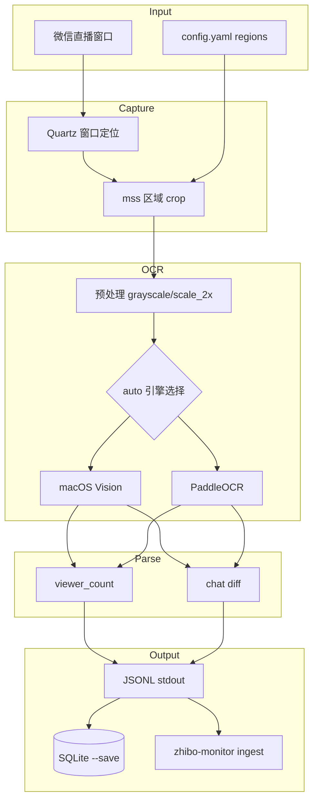

# screen-watch-CLI 技术设计

> v0.3.0 · 屏幕区域 OCR 直播监控 · 主攻微信客户端直播

## 1. 定位

| 项 | 说明 |
|---|---|
| **问题** | 微信客户端直播无 DOM/API，无法用 Playwright 抓取 |
| **方案** | 区域截屏 → OCR（Vision / PaddleOCR）→ 结构化解析 → JSONL |
| **与 zhibo-monitor** | 互补：网页 `start sph`，客户端 `screen-watch \| ingest` |
| **平台** | macOS 优先（微信 Mac 客户端） |

## 2. 架构



## 3. 命令

```bash
screen-watch window list --filter 微信
screen-watch calibrate --window "微信" --save-config config.yaml --defaults
screen-watch capture once --region viewer_count --window "微信" --save-crop logs/debug/viewer.png
screen-watch ocr --input shot.png
screen-watch monitor run --window "微信" --format jsonl --ocr-engine auto
screen-watch monitor run --demo
./scripts/e2e-smoke.sh
./scripts/pipeline-zhibo.sh
```

| 选项 | 说明 |
|------|------|
| `--ocr-engine` | `auto` \| `vision` \| `paddle` |
| `--require-foreground` | 仅前台窗口 OCR |
| `--save-crop` | 保存裁剪图便于校准 |
| `--save` | SQLite 本地落库 |

## 4. OCR 引擎

| 引擎 | 场景 | 依赖 |
|------|------|------|
| **Vision**（默认回退） | Python 3.14、macOS 快速开始 | `.[capture]` |
| **PaddleOCR** | Python ≤3.13、中文优化 | `.[ocr,capture]` |

`auto`：Paddle 可用则优先，否则 macOS Vision。

## 5. 区域配置

见 `config.yaml.example`：`viewer_count`（人数）、`chat`（弹幕），均为相对窗口 0~1 坐标。

## 6. 数据契约（JSONL）

```jsonl
{"ts":"...","type":"metric","viewer_count":687,"raw":"687人看过"}
{"ts":"...","type":"chat","user":"张三","content":"007GT多少钱"}
```

## 7. zhibo-monitor 集成

```bash
screen-watch monitor run --format jsonl | zhibo-monitor ingest --platform sph-client
```

写入 `event_tasks` / `live_metrics` / `danmaku_records`。

## 8. 实施阶段

| 阶段 | 内容 | 状态 |
|------|------|------|
| P0 | CLI 骨架 + `--demo` + verify | ✅ |
| P1 | macOS 截屏 + OCR + capture once | ✅ |
| P2 | monitor run + chat diff | ✅ |
| P3 | calibrate | ✅ |
| P4 | SQLite + start/stop | ✅ |
| P5 | zhibo-monitor ingest 管道 | ✅ |
| P6 | Vision OCR 回退 + e2e-smoke + `--save-crop` | ✅ |

## 9. 风险

1. **准确率**：弹幕 OCR 85–92%，需 calibrate
2. **权限**：屏幕录制需手动授权
3. **性能**：interval ≥ 1.5s；Vision ~200ms/区域
4. **UI 变更**：preset 需维护

## 10. 目录结构

```
screen-watch-CLI/
├── screen_watch/
│   ├── cli.py
│   ├── capture/          # macOS 截屏
│   ├── ocr/              # factory, vision, paddle
│   ├── monitor/          # pipeline, runner
│   ├── parsers/          # wechat_live
│   └── storage/          # sqlite
├── scripts/
│   ├── e2e-smoke.sh
│   ├── pipeline-zhibo.sh
│   ├── start.sh / stop.sh
├── guide/
└── tests/
```
