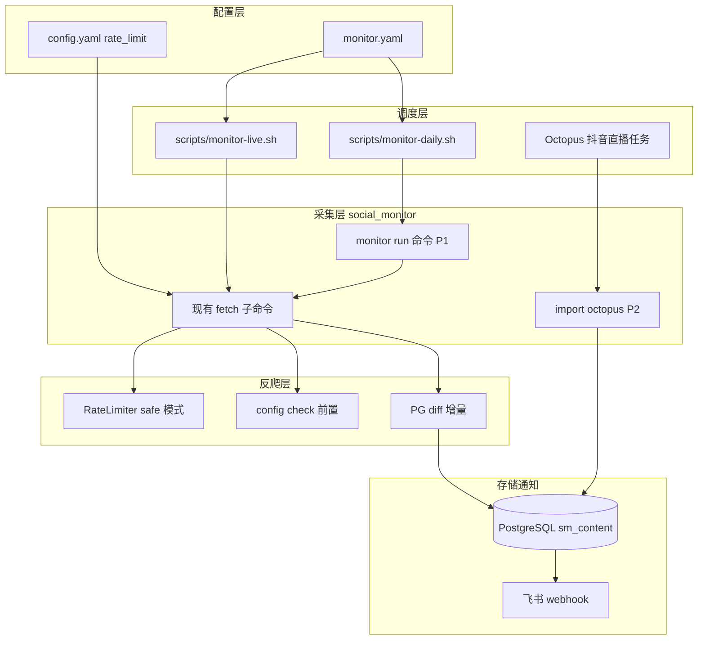

# social-monitor 监控升级完整方案

## 目标与原则

- **监控范围**：按 [guide/监控范围定义.md](guide/监控范围定义.md) 五平台定义，剔除知乎等非列渠道的日常调度
- **反爬策略**：零代理、单 IP 单账号、日请求 &lt;80、长周期轮询、`--diff` 增量、遇 403 立即停止
- **成本**：月增 ¥0（不买代理）；抖音直播弹幕交 **Octopus CLI** 采集，social-monitor 负责入库与通知
- **微博热搜**：采用**每日快照**（`account_id=trending_YYYY-MM-DD`），不做历史回补

---

## 一、整体架构



---

## 二、渠道 × 监控项 × 反爬策略矩阵

### 2.1 微博

| 监控项 | 频率 | 采集方式 | 现有能力 | 反爬策略 |
|--------|------|---------|---------|---------|
| 指定账号动态 | 每日 1 次 | `fetch weibo --uid --pages 1` | 已有 [weibo.py](social_monitor/platforms/weibo.py) | 免登录可采；有 Cookie 时专号专用；间隔 ≥10s |
| 日热搜快照 | 每日 1 次 08:00 | `fetch weibo-trending` | 已有，缺 `--date` 归档 | 免登录；`account_id=trending_{date}` |

**缺口开发**：
- CLI `fetch weibo-trending` 增加 `--date`（默认今天），`--save` 时 `account_id=trending_2026-06-23`
- 编排时固定 `--pages 1 --save --diff`

### 2.2 微信公众号

| 监控项 | 频率 | 采集方式 | 现有能力 | 反爬策略 |
|--------|------|---------|---------|---------|
| 指定号发文 | 每日 1 次 | RSSHub + `fetch wechat` | 已有 [wechat.py](social_monitor/platforms/wechat.py) | 不走搜狗直爬；RSSHub 缓存；12h 一次 |

**依赖**：[docker-compose.yml](docker-compose.yml) 中 postgres + redis + rsshub 常驻。

### 2.3 B站

| 监控项 | 频率 | 采集方式 | 现有能力 | 反爬策略 |
|--------|------|---------|---------|---------|
| 指定 UP 视频 + 互动 | 每日 1 次 | `fetch bilibili --uid` | 已有 view/comment；缺 coin/like/favorite | 免登录；Referer 已设；间隔 ≥10s |
| 视频弹幕词云 | 新视频触发 | `fetch bilibili-danmaku --words` | 已有 [bilibili.py](social_monitor/platforms/bilibili.py) | 按 bvid 清单，非全量扫 |
| 视频评论 Top N | 新视频触发 | `fetch_hot_comments(aid)` | **代码有、CLI 无** | 每视频限 20 条 |
| 直播弹幕 | 开播事件 | `fetch live-danmaku` | 已有 WebSocket | 单次 ≤30min；未开播跳过 |

**缺口开发**（P1 核心）：
- 新增 `fetch bilibili-comments --aid/--bvid --limit 20`
- 新增 `fetch_video_stat(aid)` 拉完整互动（play/like/coin/favorite/share/danmaku）并 CLI 暴露
- [scripts/monitor-live.sh](scripts/monitor-live.sh)：轮询 `live_status`，=1 时触发 `live-danmaku --duration 1800`

### 2.4 抖音

| 监控项 | 频率 | 采集方式 | 现有能力 | 反爬策略 |
|--------|------|---------|---------|---------|
| 指定账号视频 + 互动 | 每日 1 次 | `fetch douyin --sec-uid` | 已有 statistics 字段 [douyin.py](social_monitor/platforms/douyin.py) | 1 个小号 Cookie；6h 一次 |
| 视频评论 | 新视频触发 | 待开发 | 无 | Cookie + 浏览器；每视频 ≤20 条 |
| 直播弹幕 | 开播事件 | **Octopus 采集 → import** | 无 | 不在 social-monitor 直采 |

**Octopus 分工**（用户确认）：
- Octopus 跑抖音直播弹幕模板，输出标准 JSON
- social-monitor 新增 `import octopus --file result.json --platform douyin --type live_danmaku` 写入 PG
- [scripts/monitor-live.sh](scripts/monitor-live.sh) 检测到开播后调用 Octopus CLI（外部），完成后 import

### 2.5 小红书

| 监控项 | 频率 | 采集方式 | 现有能力 | 反爬策略 |
|--------|------|---------|---------|---------|
| 主题帖 | 每日 1 次 | 关键词搜索 | **无 search API** | Playwright；5~10s 间隔；每主题 ≤20 帖 |
| 用户评论 | 新帖触发 | 评论列表 | **无** | 每帖 ≤20 条；12~24h 一轮 |

**缺口开发**（P2，工作量最大）：
- [xiaohongshu.py](social_monitor/platforms/xiaohongshu.py) 增加 `search_notes(keyword)`、`fetch_note_comments(note_id)`，走现有 `browser_fetch_json`
- CLI：`fetch xiaohongshu-search --keyword`、`fetch xiaohongshu-comments --note-id`
- 短期兜底：monitor.yaml 支持 `topics` 与 `users` 二选一，用户列表可用现有 `fetch xiaohongshu`

---

## 三、横切反爬能力（全渠道共用）

在 [config.yaml.example](config.yaml.example) 增加：

```yaml
rate_limit:
  mode: safe          # safe: 10~20s | normal: 2~3s
  daily_max_requests: 80
  stop_on_403: true

monitor:
  feishu_on_diff: true
  skip_on_check_fail: true
```

代码改动（P0~P1）：

| 模块 | 改动 |
|------|------|
| [rate_limiter.py](social_monitor/utils/rate_limiter.py) | 读取 `rate_limit.mode`；safe 模式 10~20s |
| [base.py](social_monitor/platforms/base.py) | 初始化时注入全局 RateLimiter |
| [http_client.py](social_monitor/utils/http_client.py) | 403/429 记录日志并抛 `ScrapeBlockedError`（供编排层停止） |
| [prefetch.py](social_monitor/utils/prefetch.py) | 扩展 `weibo-user`、`douyin-user`、`xhs` 到日调度前置检查 |
| CLI | 全局 `--safe` 标志覆盖 rate_limit |

**不做**：IP 池、Cookie 池、验证码打码、分布式。

---

## 四、配置与编排

### 4.1 monitor.yaml（新建 `~/.social-monitor/monitor.yaml`）

```yaml
weibo:
  accounts: ["uid1", "uid2"]
  trending: { enabled: true, time: "08:00" }

wechat:
  accounts: ["MzAxxxx"]
  time: "09:00"

bilibili:
  accounts: [{ uid: 614946423 }]
  live_rooms: [12345]
  video_danmaku: true
  comments_limit: 20
  time: "10:00"

douyin:
  accounts: [{ sec_uid: "MS4w..." }]
  comments: false          # P2 开启
  octopus_live_template: "douyin-live-danmaku"  # 外部模板名
  time: "11:00"

xiaohongshu:
  topics: ["新能源汽车"]
  comments_per_note: 20
  mode: browser
  time: "12:00"
```

### 4.2 调度脚本

| 脚本 | 职责 |
|------|------|
| `scripts/monitor-daily.sh` | 读 monitor.yaml，错峰执行各平台日任务，`config check` 前置，`--save --diff` |
| `scripts/monitor-live.sh` | B站/抖音直播间开播检测；B站直采；抖音调 Octopus + import |
| `scripts/start.sh` / `stop.sh` / `verify.sh` | 扩展：启动 PG+Redis+RSSHub；verify 增加 monitor 冒烟 |

### 4.3 CLI 编排命令（P1）

新增 `social-monitor monitor run [--task daily|live] [--dry-run]`：
- 解析 monitor.yaml
- 调用现有 collector / fetch 逻辑（复用 [cli.py](social_monitor/cli.py) 内部函数，避免 shell 拼接）
- 汇总 diff 结果，可选调 [feishu.py](social_monitor/notifiers/feishu.py)

---

## 五、数据模型

**首期不迁移表结构**：用 `platform` + `account_id` 约定区分内容类型（[postgres_storage.py](social_monitor/storage/postgres_storage.py) 的 `raw_data` JSONB 存全量字段）。

| platform | account_id 模式 | 含义 |
|----------|----------------|------|
| weibo | `{uid}` / `trending_{date}` | 动态 / 日热搜 |
| wechat | `{wxid}` | 文章 |
| bilibili | `{uid}` / `{bvid}` / `live_{room_id}` | 视频 / 弹幕词 / 直播 |
| douyin | `{sec_uid}` / `live_{room_id}` | 视频 / Octopus 直播 |
| xiaohongshu | `topic:{kw}` / `{note_id}` | 主题帖 / 评论 |

**P2 可选**：`sm_content` 增加 `content_type VARCHAR(30)` 列 + 索引，便于 SQL 汇总。

---

## 六、分阶段实施计划

### Phase 0 — 文档与零代码编排（1~2 天）

- 完善 [guide/监控范围定义.md](guide/监控范围定义.md)：渠道矩阵、反爬红线、account_id 约定
- 新建 `monitor.yaml.example` + `scripts/monitor-daily.sh`（调用现有 CLI）
- 更新 [tests/测试计划.md](tests/测试计划.md)：按新范围裁剪知乎热榜等非列用例
- cron 示例写入文档

**验收**：手动跑 daily 脚本，PG 有五平台（含抖音视频）记录；微博热搜可按日期查询。

### Phase 1 — 反爬 + B站/微博补齐（3~5 天）

- `rate_limit` 配置 + `--safe` + 403 停止
- `weibo-trending --date`
- `bilibili-comments` CLI + `fetch_video_stat`
- `monitor run --task daily` 初版
- `monitor-live.sh` B站开播检测

**验收**：B站新视频自动拉评论+互动；日请求日志可统计；403 不 retry。

### Phase 2 — 抖音评论 + Octopus 接入 + 小红书（5~8 天）

- `douyin.fetch_video_comments`（Playwright 或 httpx+Cookie）
- `import octopus` 命令 + Octopus JSON Schema 文档
- `xiaohongshu.search_notes` + `fetch_note_comments` + CLI
- 飞书 diff 汇总通知

**验收**：抖音直播弹幕经 Octopus 入库；小红书主题+评论链路通。

### Phase 3 — 运维加固（持续）

- `daily_max_requests` 硬限制
- PG `content_type` 迁移（可选）
- 监控告警：Cookie 失效、RSSHub 宕机、池可用率（日志级）

---

## 七、每日调度时间表（10 账号规模）

| 时刻 | 任务 | 预估请求 |
|------|------|---------|
| 08:00 | 微博热搜快照 + 账号 ×N | 1+N |
| 09:00 | 公众号 ×M | M |
| 10:00 | B站 UP 视频 + 新视频弹幕/评论 | K+增量 |
| */30min | 直播开播检测（B站+抖音） | 房间数 |
| 开播时 | B站 live-danmaku / Octopus 抖音 | 1 次/场 |
| 11:00 | 抖音视频列表 | P |
| 12:00 | 小红书主题+评论 | T×20 |

日合计约 **50~80 次 HTTP**，符合安全配额。

---

## 八、风险与回退

| 风险 | 缓解 |
|------|------|
| 小红书签名失败 | 仅 browser 模式；失败跳过当日，不加重试 |
| 抖音 Cookie 失效 | `config check` 前置 + 飞书告警；暂停评论采集 |
| Octopus 不可用 | 抖音直播仅记录「未采集」，不降级直采 |
| RSSHub 故障 | 微信通道暂停，日志明确报错 |

---

## 九、关键文件清单

| 操作 | 文件 |
|------|------|
| 新建 | `guide/监控范围定义.md`（完整版）、`monitor.yaml.example`、`scripts/monitor-daily.sh`、`scripts/monitor-live.sh`、`scripts/start.sh`、`scripts/stop.sh` |
| 修改 | [config.yaml.example](config.yaml.example)、[config.py](social_monitor/config.py)、[rate_limiter.py](social_monitor/utils/rate_limiter.py)、[http_client.py](social_monitor/utils/http_client.py)、[cli.py](social_monitor/cli.py)、[bilibili.py](social_monitor/platforms/bilibili.py)、[douyin.py](social_monitor/platforms/douyin.py)、[xiaohongshu.py](social_monitor/platforms/xiaohongshu.py) |
| 新建模块 | `social_monitor/monitor/runner.py`（编排）、`social_monitor/importers/octopus.py`（P2） |
| 测试 | `tests/test_monitor_runner.py`、`tests/test_bilibili_comments.py`、`tests/test_weibo_trending_date.py` |
